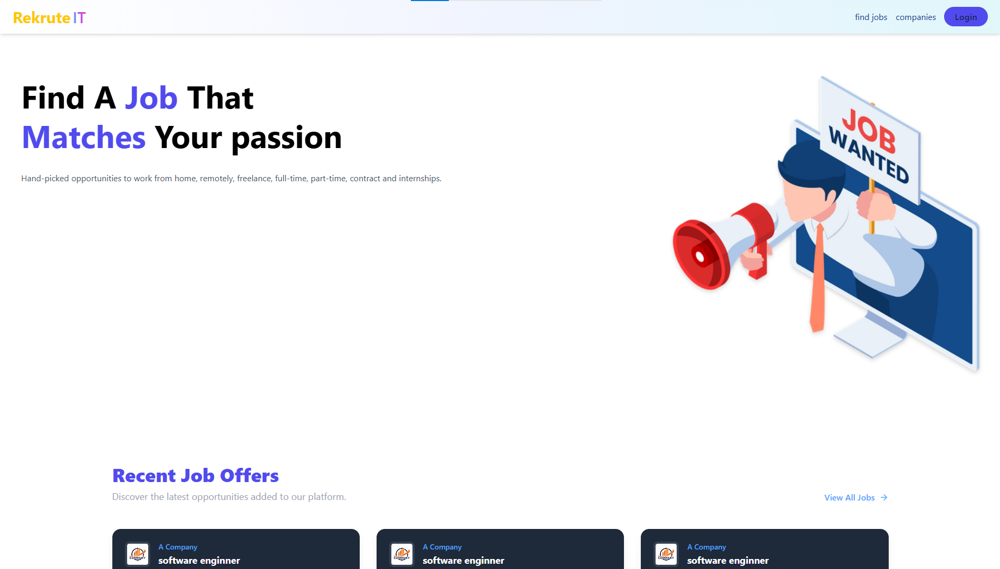
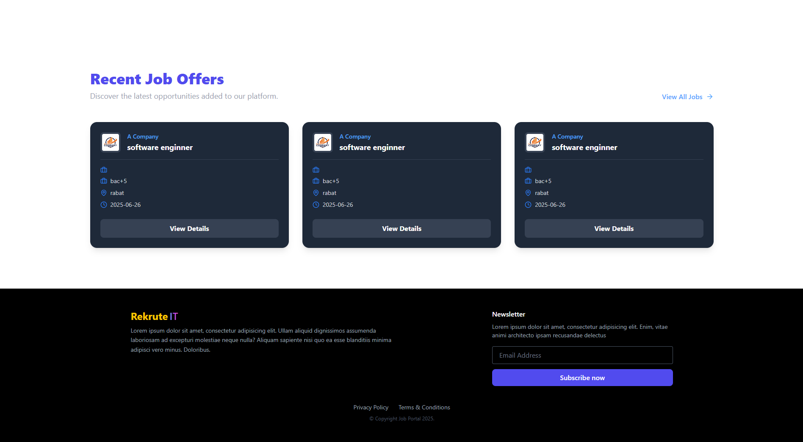

# RekruteIT

A recruitment platform that connects job seekers with recruiters seamlessly. This application provides tailored dashboards for both recruiters and candidates, supports offer management, favorites, application tracking, and much more.

---

## Screenshots

### landing page

### login page

### email confirmation page

### offers page

### offer details

### rekruters page

### rekruter details

## candidat dashboard
### profile page

### edit profile page

### applications page

## rekruter dashboard
### profile page

### edit profile page

### offers page

### edit offer page

### applications page

---

## Features

### Authentication

- Signup & Login
- Role-based navigation (Candidat & Recruteur)
- Email verification flow with code validation

### Candidate Dashboard

- Profile view and edit
- Job applications tracking
- Saved job offers
- Settings management

### Recruiter Dashboard

- Manage job offers (add/edit/delete)
- View applications per offer
- Recruiter profile edit
- Settings management

### Public Pages

- Home (Main)
- Job Listings
- Recruteur list and individual details
- Job offer details
- Candidat public profiles

---

##  Technologies Used

### Frontend

- *ReactJS*
- *Redux Toolkit*
- *TailwindCSS*
- *Lucide-react*
- 
### Backend

- *Spring Boot*
- *JWT Authentication*
- *MySQL*
- *Spring Data JPA*

