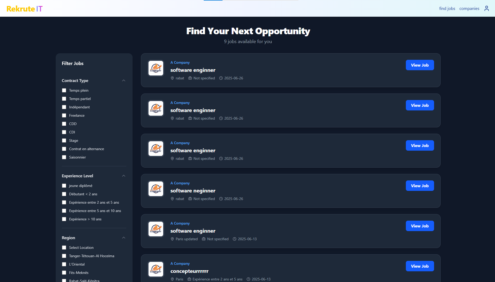
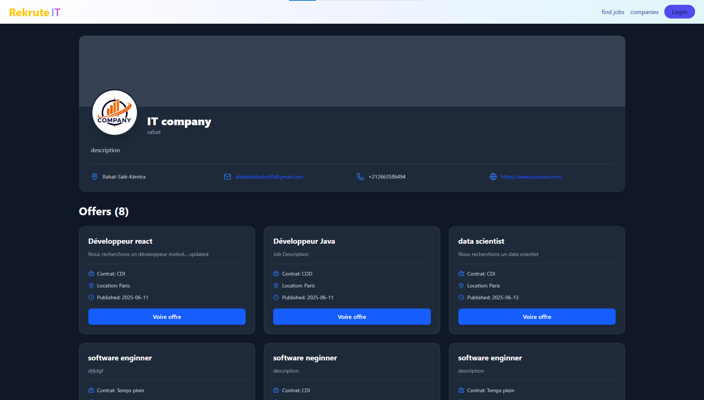
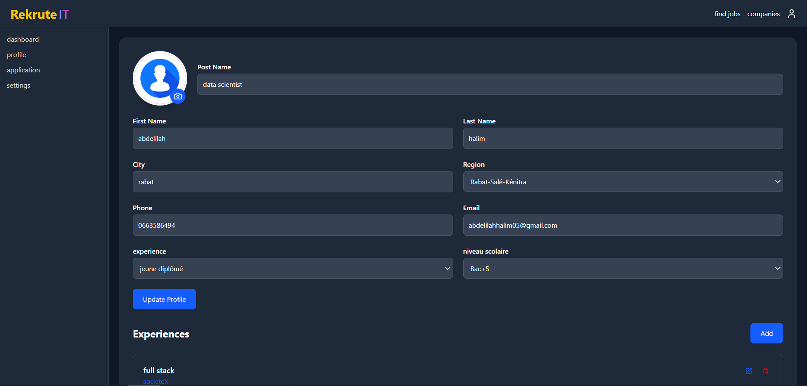
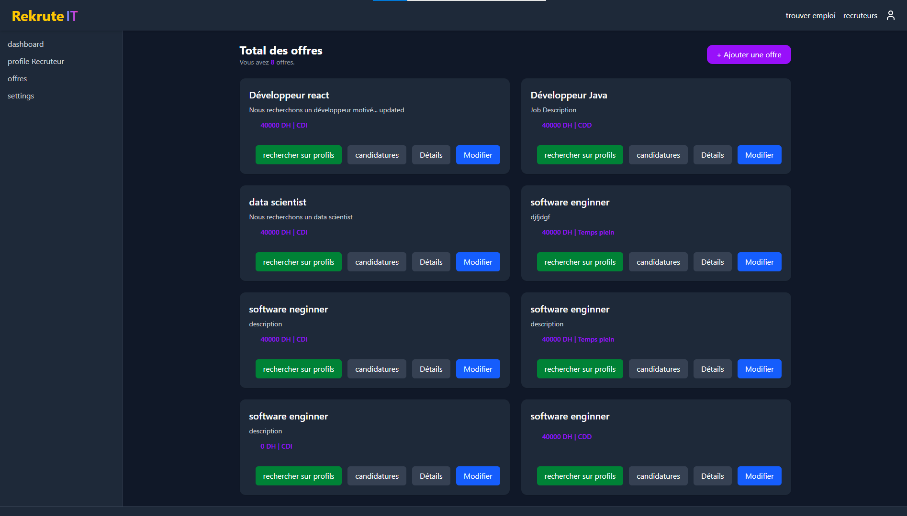

# RekruteIT - Job Recruitment Platform

RekruteIT is a job recruitment platform that connects candidates and recruiters. It features separate dashboards for each user type, job offer management, and application tracking.

---

##  Key Features
-   **AI-Powered Matching:** Uses a local sentence-transformer model to calculate a "match score" between candidate profiles and job offers.
-   **Separate Dashboards:** Custom interfaces for both Candidates and Recruiters.
-   **Job Search:** Find and filter job offers by type, experience, and region.
-   **Profile Management:** Users can add their experience, education, and skills.
-   **Secure Authentication:** JWT-based login and signup with email verification.
-   **Responsive Design:** Works on all screen sizes

---

##  AI Integration

This project runs its own local AI model for semantic search and matching.

-   **Model:** `sentence-transformers/all-MiniLM-L6-v2`.
-   **Function:** Instead of basic keyword matching, the model converts the text from candidate profiles (skills, experience) and job descriptions into meaningful numerical vectors (embeddings).
-   **Outcome:** By calculating the similarity between these vectors, the platform generates a **match score**, providing highly relevant recommendations for both recruiters and candidates. This process runs locally, ensuring fast response times and data privacy.

##  Screenshots

<b>Public Pages & User Experience</b>

### Landing Page
 

### Job Listings Page

### Job Offer Details

### Recruiters Page

### Recruiter Details Page

<b>Authentication Flow</b>

### Signup Forms
 

### Login & Verification
 

<b>Candidate Dashboard</b>

### Dashboard Home

### View & Edit Profile

### Add/Edit Modals

### My Applications Page

### Settings Page

<b>Recruiter Dashboard </b>

### Dashboard Home

### View & Edit Company Profile

### Job Offer Management

### Edit Offer Page

### Applicant Tracking

### Candidate Search

---

##  Technologies Used

### Frontend
-   ReactJS
-   Redux Toolkit
-   React Router
-   TailwindCSS
-   Axios
-   Lucide-react

### Backend
-   Spring Boot 3
-   Spring Security (JWT)
-   Spring Data JPA
-   MySQL
-   Lombok

### Machine Learning / AI
-   Python
-   Sentence-Transformers
-   Hugging Face Transformers
-   PyTorch
-   (Served via a local Flask)

---

## 🗃️ Database Schema

The database schema shows the relationships between users, candidates, recruiters, offers, and applications.

